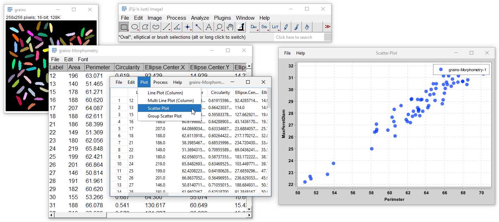

TableJ is a plugin for Fiji/ImageJ that provides management of data tables in a more extensive 
way than native ImageJ does.

Features of TableJ include:
* management of Tables with both numeric and categorical columns
* display of Table instances in specific frame
* edition of tables: display table info / summary, selection of rows or columns...
* plotting facilities: line plot, scatter plot, histogram...
* analysis: Principal Component Analysis
* import and export from CSV files

## Installation

### Manual installation

* Copy the "[TableJ.x.y.z.jar](https://github.com/ijtools/TableJ/releases/download/v0.0.1/TableJ_-0.0.1.jar)" into the "plugins" directory of your ImageJ/Fiji installation 
(update version numbers according to latest release)
* Download a recent version of [the xchart library](https://knowm.org/open-source/xchart/) (used for plotting, requires at least XChart-3.8.8), and copy it into the "jars" directory of ImageJ/Fiji
* Restart ImageJ / Fiji.

## Usage

After installation, new menu entries appear within the "Plugins -> IJ Tools -> TableJ" menu:
* **Convert Results** Table allows for converting an existing Table from ImageJ into a Table instance within TableJ
* **Import Table** Imports a new Table from an existing csv file
* **Open Demo Table** Opens a simple data table (Fisher's iris) for testing purpose.
